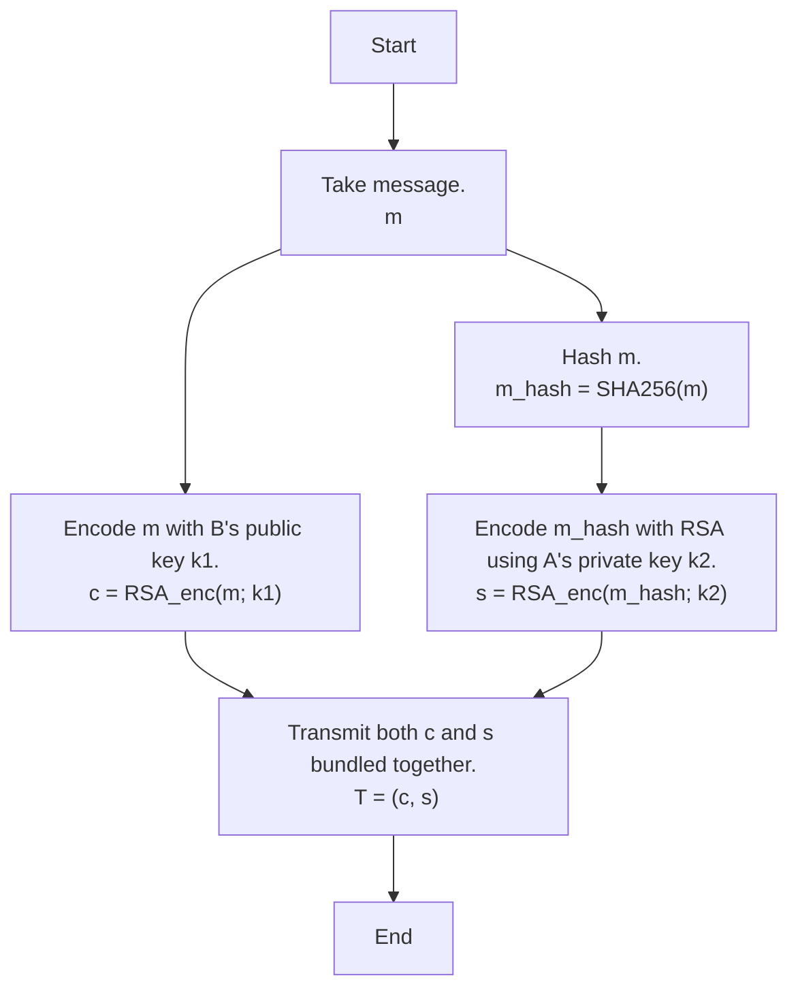
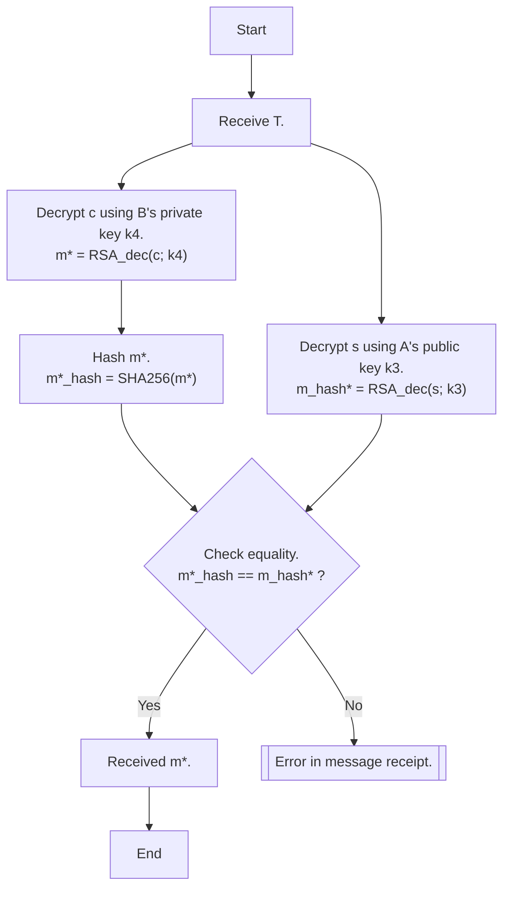

# rsa_pychat
RSA PyChat is a Python 3.10 based TCP messaging application that uses the [RSA cryptosystem](https://en.wikipedia.org/wiki/RSA_(cryptosystem) "RSA (cryptosystem) - Wikipedia") to secure communication. Currently this version does not use [OAEP](https://en.wikipedia.org/wiki/Optimal_asymmetric_encryption_padding "Optimal asymmetric encryption padding - Wikipedia"), however this may be likely to change. This version includes a basic implementation of RSA, as well as an implementation of [SHA256](https://en.wikipedia.org/wiki/SHA-2 "SHA-2 - Wikipedia").

# Basic Operation
We take for example a conversation between Alice (A) and Bob (B), with Alice being the sender and Bob the recipient.

The basic operation on Alice's end is as follows:

... and on Bob's end:

